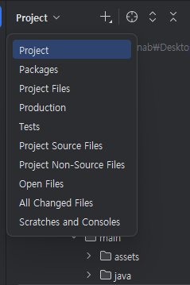

## 여행 안내 어플 만들기
리액트 네이티브를 이용해 ios, android 모두 가능한 여행 안내 어플을 만들고 있다. (그런데 일단 안드로이드만 등록할 거 같은 느낌..)
안드로이드 스튜디오를 사용하다가 다른 사람들은 어플 아이콘을 아주 쉽게 바꾸던데 왜인지 나는,, 아무것도 보이지 않길래 이유가 뭐지? 하다가 방법을 찾아 적어본다.
그러는 김에 겸사겸사 마주했던 문제들을 어떤 식으로 해결했는지도 적어 봄

### 파일 경로에 한글이 포함된 경우
- Sdk 같은 경우 따로 깔아야할 때가 있는데 윈도우 사용자명이 한글로 등록이 되었거나 하는 문제 등으로 파일 경로에 한글이 포함될 경우 무조건 오류가 난다.
- 이런 경우 설치할 위치를 따로 정하는 것이 좋다. 예를 들어 C드라이브에 직접 폴더를 만들고 해당 폴더에 지정하는 식으로 하면 된다.
- Program Files 폴더 안의 Android 폴더에 Sdk를 만들 경우, 폴더 경로에 공백이 생겨 이슈가 발생할 수 있으니 주의해야함.

### Sdk를 인식 못하는 경우
- load.properties라는 파일이 없는 경우 android 폴더 내에 생성
- 해당 파일 내에 다음과 같이 sdk의 경로 지정
    ```
    sdk.dir=C:\\Users\\<사용자명>\\AppData\\Local\\Android\\Sdk
    ```
    - 만약 사용자명이 한글이라 다른 경로를 지정했다면 그 경로로 쓰면 됨
    - 띄어쓰기 하면 안됨, 백슬래시(\\)는 두 개
- 시스템 환경 변수 설정
    - 키: `ANDROID_HOME`
    - 값: `C:\Users\사용자이름\AppData\Local\Android\Sdk`
        - 마찬가지로 Sdk의 경로가 다를 경우 해당 경로를 써주면 됨
        - 여기선 백슬래시 하나
- 환경 변수 상단에 Path 찾아서 더블 클릭 후 다음 경로 추가
    - `C:\Users\사용자이름\AppData\Local\Android\Sdk\emulator`
    - `C:\Users\사용자이름\AppData\Local\Android\Sdk\platform-tools`


### ndk를 인식 못하는 경우
- 안드로이드 스튜디오 상단에서 햄버거 버튼 -> Tool 탭 -> Sdk Manager 클릭
- Sdk Manager에서 Sdk Tools로 이동
- Ndk 안깔려 있는 경우 체크해서 깔아주기

### Image Asset을 킬 수 없는 경우
- 안드로이드 스튜디오가 폴더를 안드로이드 프로젝트라고 인식하지 못하기 때문에 일어나는 문제
- 프로젝트 폴더 자체가 안드로이드 스튜디오에서 생성하지 않았거나, 비슷한 경우라면 프로젝트 폴더를 그냥 여는 것이 아니라 android라는 폴더를 찾아서 열고 gradle이 동기화될 때까지 기다려야 함
- gradle이 동기화되고 나면 왼쪽 상단의 Project(사진)라고 되어있던 부분이 Android로 바뀜
     
- res에서 우클릭하면 Image Asset 설정 가능